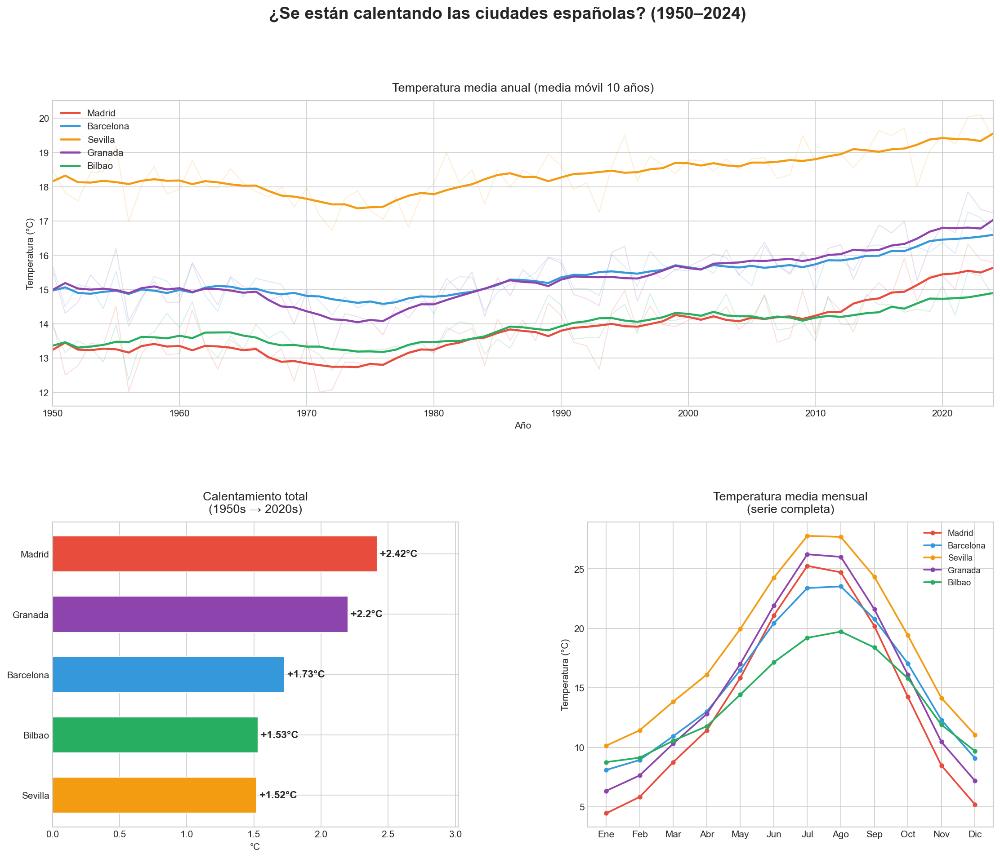

# Climate Analysis Spain — Temperature Trends (1950–2024)

This project analyses historical daily temperature data for 5 major Spanish cities over 7 decades, using Python and open climate data.



## Key Findings

- All 5 cities show a clear warming trend between 1950 and 2024.
- Average warming across cities: ~+1.88°C over 70 years.
- The warming trend accelerates noticeably from the 1980s onwards.
- Interior cities (Madrid, Granada) show stronger warming than coastal/southern ones (Bilbao, Sevilla).

## Tools & Libraries

- Python
- pandas, numpy
- matplotlib, seaborn
- requests

## How to Run

1. Clone this repository:
   ```bash
   git clone https://github.com/alvarorumi/climate-analysis-spain.git
   cd climate-analysis-spain
   ```

2. Install dependencies:
   ```bash
   pip install -r requirements.txt
   ```

3. Run the analysis:
   ```bash
   python climate_analysis.py
   ```

The script will:
- Download historical temperature data automatically (no manual download needed)
- Print a statistical summary in the terminal
- Save a multi-panel chart as `climate_spain_analysis.png`

## Visualisations

The output chart includes three panels:

1. **Annual mean temperature** (10-year moving average) — shows the long-term warming trend for each city
2. **Total warming per city** — compares warming between the 1950s and 2020s
3. **Monthly temperature profile** — seasonal patterns across the full series

## Data Source

[Open-Meteo Historical Weather API](https://open-meteo.com/) — free, no registration required, based on ERA5 reanalysis data from the Copernicus Climate Change Service.

## Author

**Álvaro Rubio Milán**
Physics graduate · Junior Data Analyst
[LinkedIn](https://linkedin.com/in/alvaro-rubio-milan-8736b22a8)

## Notes

This project was developed as part of a personal data analysis portfolio, combining a background in geophysics with practical Python data analysis skills. The methodology is intentionally straightforward to focus on clarity of insight over complexity of implementation.
